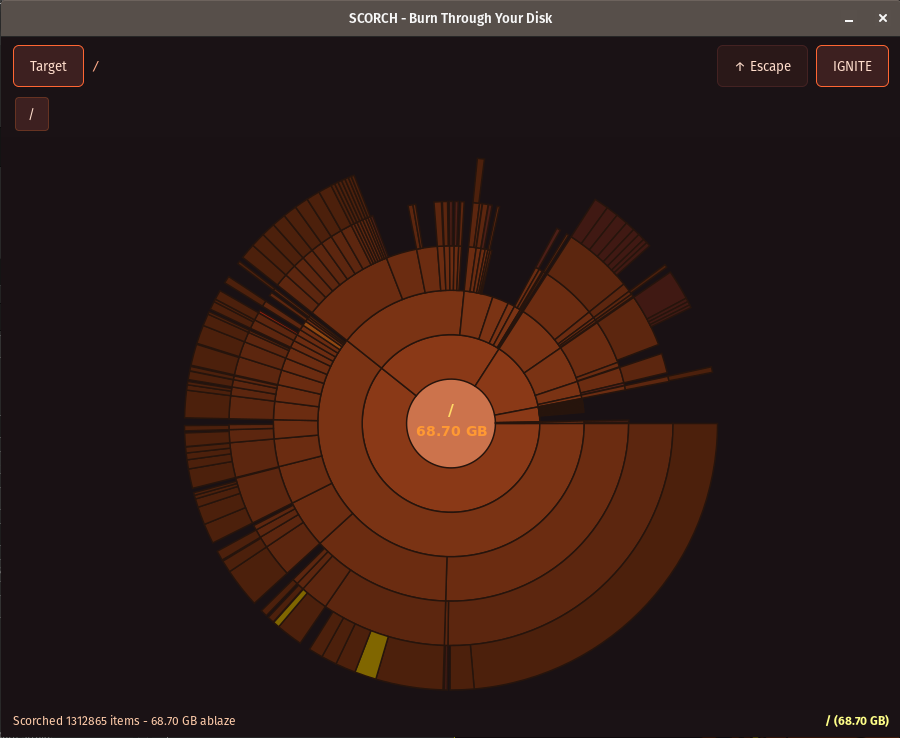

# SCORCH

### *Burn Through Your Disk to Find What's Scorching Your Storage*


---

## Your disk is on fire. Let's find out why.

You know that feeling when your 1TB drive is somehow full and you have no idea why? When `node_modules` has achieved sentience and is consuming everything in its path? When you're mass-deleting random folders like a desperate gambler?

**Scorch** shows you *exactly* what's burning through your storage with a beautiful sunburst visualization. Click to drill down. Right-click to delete. Watch your disk space return from the ashes.



---

## It's written in Rust btw

You know what that means:

- **BLAZINGLY FAST** (legally required to say this)
- **MEMORY SAFE** (no segfaults, only regrets about that 50GB "temp" folder from 2019)
- **FEARLESS CONCURRENCY** (scans your disk while you fearlessly confront your hoarding tendencies)
- Scanned **1.3 million files** in the screenshot above. Your move, Electron apps.

---

## Features

- **Sunburst Visualization** - Pretty circles that reveal your shame
- **Click to Navigate** - Drill down into directories like a forensic accountant
- **Right-click to Delete** - Purge files with extreme prejudice (confirmation dialog included, we're not monsters)
- **Fire-themed UI** - Because your storage situation is an emergency
- **Protected System Paths** - We won't let you `rm -rf /` yourself, even if you ask nicely

---

## Installation

```bash
# Clone this dumpster fire
git clone https://github.com/yourname/scorch
cd scorch

# Let cargo do its thing
cargo build --release

# IGNITE
./target/release/scorch
```

### Dependencies

- GTK4 (for the fancy graphics)
- A mass storage device full of regrets

```bash
# Ubuntu/Debian
sudo apt install libgtk-4-dev

# Fedora
sudo dnf install gtk4-devel

# Arch btw
sudo pacman -S gtk4
```

---

## Usage

1. Click **Target** to select a directory
2. Click **IGNITE** to start the scan
3. Watch in horror as the visualization reveals the truth
4. Click segments to drill down
5. Right-click to delete (the files, not your feelings)
6. Press **Escape** to navigate back up

---

## Why "Scorch"?

Because your disk space situation is a *dumpster fire* and it's time to face it.

Also because every Rust project needs an aggressive single-word name. It's the law.

---

## Performance

| What | How Fast |
|------|----------|
| Scanning 1M+ files | Yes |
| UI responsiveness | Buttery smooth |
| Deleting node_modules | Cathartic |

---

## Contributing

Found a bug? Open an issue.

Want to add a feature? PRs welcome.

Want to tell me about your 200GB Steam library you've never touched? I understand. We all have our demons.

---

## License

MIT - Do whatever you want, just don't blame me when you accidentally delete something important.

---

<p align="center">
  <i>"At least now I know WHY it's on fire"</i>
</p>
